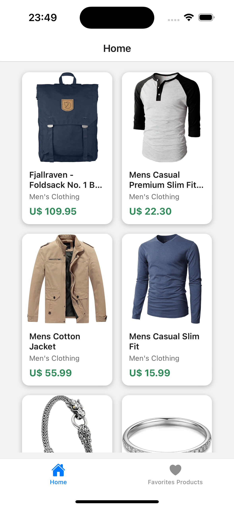
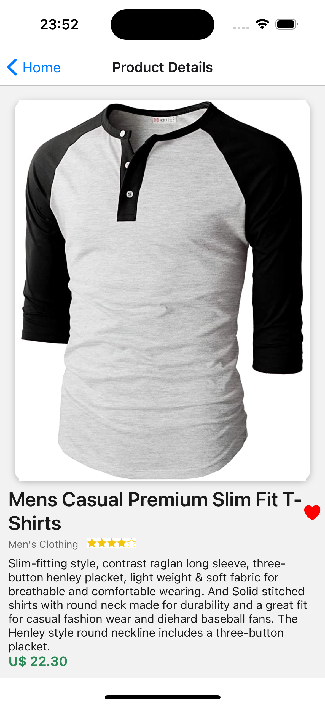

# ProductsList - AiQueFome Challenge 🍔

Um aplicativo React Native para listar e favoritar produtos, desenvolvido como parte do desafio técnico da AiqFome.

## 📱 Screenshots

## Home Screen



### Product Details



### Favorites


## 🚀 Tecnologias Utilizadas

- React Native
- Expo
- TypeScript
- Zustand (Gerenciamento de Estado)
- React Navigation
- Axios
- AsyncStorage
- Jest (Testes)

## 📱 Funcionalidades

- [x] Listagem de produtos
- [x] Detalhes do produto
- [x] Favoritar produtos
- [x] Persistência local de dados
- [x] Navegação entre telas
- [x] Layout responsivo

## 🛠️ Estrutura do Projeto

src/
├── components/ # Componentes reutilizáveis
├── hooks/ # Custom hooks
├── navigation/ # Configuração de navegação
├── screens/ # Telas do aplicativo
├── services/ # Serviços (API, etc)
├── store/ # Gerenciamento de estado
└── types/ # Tipagens TypeScript

## 🔧 Pré-requisitos

- Node.js (versão 14 ou superior)
- Yarn ou NPM
- Expo CLI
- iOS Simulator ou Android Emulator

## ⚙️ Instalação

1. Clone o repositório:

```bash
git clone https://github.com/MateusCastro2203/aiqfome-test
cd ProductsList-aiquefome
```

2. Instale as dependências:

```bash
yarn install
```

3. Inicie o projeto:

```bash
yarn start
```

4. Execute no emulador:

```bash
# Para iOS
yarn ios

# Para Android
yarn android
```

## 📋 Escolhas Técnicas

### Gerenciamento de Estado (Zustand)

- Escolhido pela sua simplicidade e performance
- Integração fácil com TypeScript
- Persistência automática com AsyncStorage

### Navegação (React Navigation)

- Stack Navigator para navegação entre telas
- Tipagem forte para parâmetros de rota
- Suporte a gestos nativos

### Requisições HTTP (Axios)

- Cliente HTTP robusto
- Interceptors para tratamento de erros
- Tipagem forte para respostas

### Estilização

- StyleSheet para melhor performance
- Layout responsivo
- Dimensões calculadas dinamicamente

### Persistência de Dados

- AsyncStorage para dados locais
- Zustand persist middleware
- Cache de imagens

## 📱 Telas

### Home

- Lista de produtos em grid
- Pull to refresh
- Loading states
- Tratamento de erros

### Detalhes do Produto

- Informações detalhadas
- Imagem em destaque
- Botão de favoritar
- Preço formatado

### Favoritos

- Lista de produtos favoritados
- Persistência local
- Remoção de favoritos
- Estado vazio estilizado

## 🧪 Testes

```bash
# Rodar todos os testes
yarn test

# Rodar testes em modo watch
yarn test:watch

# Verificar cobertura de testes
yarn test:coverage
```

## 📦 Build

Para gerar uma build de produção:

```bash
# Para Android
yarn android:build

# Para iOS
yarn ios:build
```
